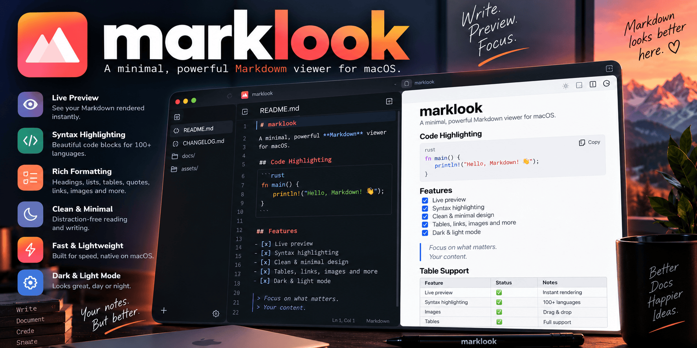
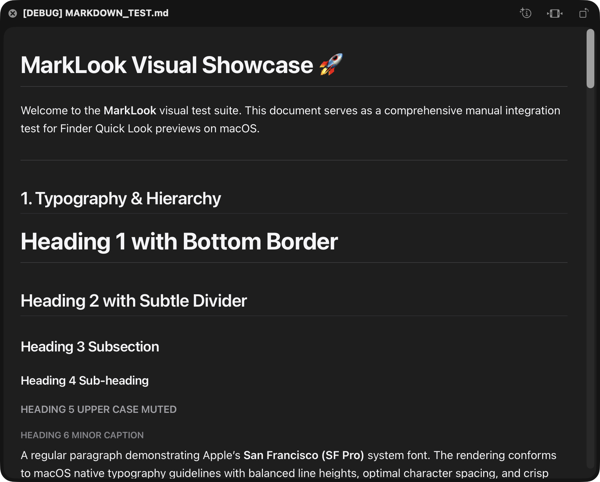
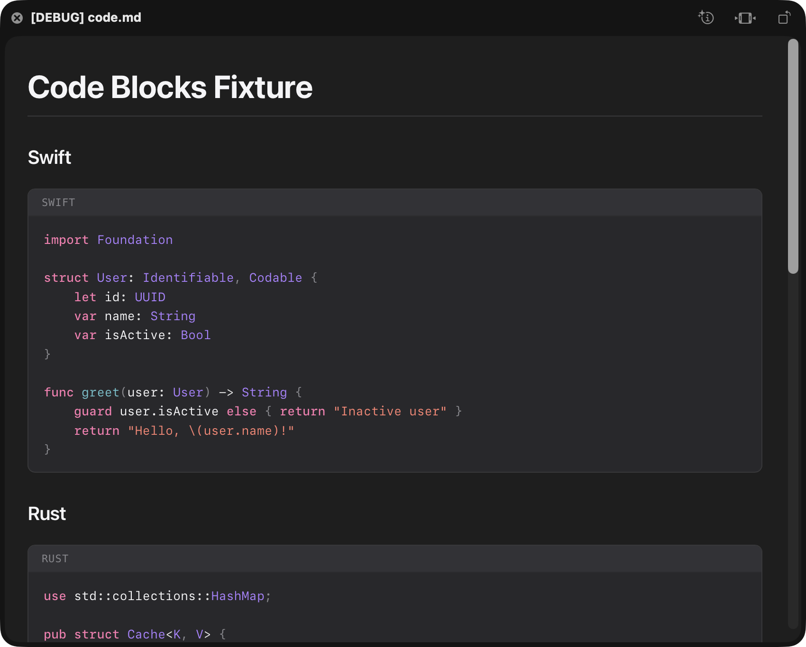
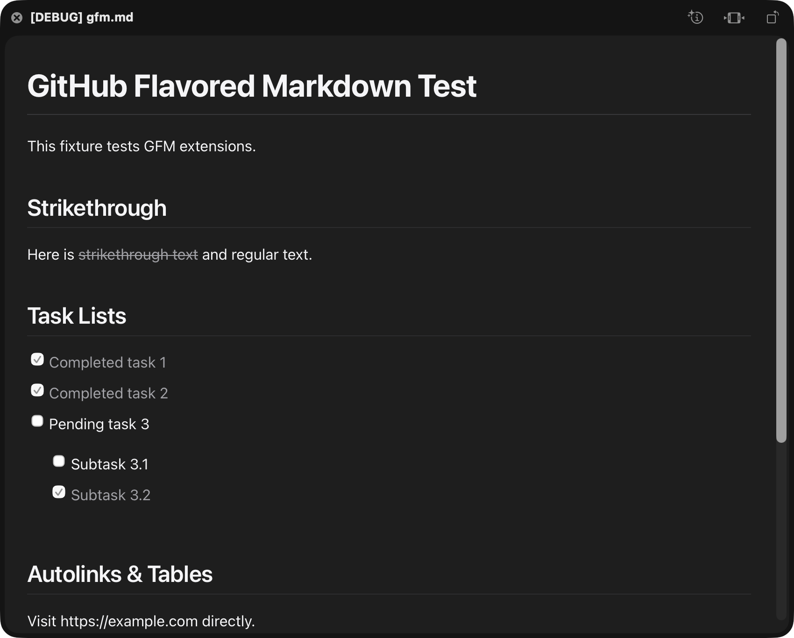

# MarkLook

<div align="center">
  

  <br><br>

  <a href="README.md">
    
  </a>
  &nbsp;
  <a href="README.de.md">
    
  </a>

  <br><br>

[](https://github.com/pepperonas/marklook/releases)
[](https://github.com/pepperonas/marklook)
[](Tests/MarkLookTests/)
[](Sources/)
[](LICENSE)
<br>
[](https://apple.com/macos)
[](https://swift.org)
[](Sources/MarkLookPreview/Resources/MarkLookPreview.entitlements)
[](https://github.com/pepperonas/marklook)
[](https://github.com/pepperonas/marklook)
[](https://github.com/pepperonas/marklook)
[](https://semver.org)
[](CHANGELOG.md)
<br><br>
<a href="https://www.paypal.com/donate/?business=martin.pfeffer%40celox.io&item_name=MarkLook&currency_code=EUR">
  
</a>

<br><br>

```
┌────────────────────────────────────────────────────────────┐
│  Finder → Select Any Markdown File (.md) → Press Space     │
│  Instant, beautifully rendered native Markdown preview!    │
└────────────────────────────────────────────────────────────┘
```

</div>

---

## Overview

**MarkLook** is a lightweight, blazing-fast native macOS application and Quick Look Preview Extension (`io.celox.marklook.preview`) that brings rich Markdown rendering directly to the macOS Finder.

Pressing **Space** on any `.md` or `.markdown` file instantly presents formatted typography, pure-Swift syntax-highlighted code blocks, GitHub-style task lists, and styled tables — without third-party web runtimes, Electron, or background daemons.

Designed strictly according to Apple's Human Interface Guidelines, MarkLook looks and feels like a native macOS system component.

---

## Screenshots

| Visual Showcase & Typography | Syntax Highlighting | GFM Task Lists & Tables |
| :---: | :---: | :---: |
|  |  |  |

---

## Key Features

- ⚡ **Instant Preview**: Rapid startup using Apple's modern data-based `QLPreviewProvider` and `QLPreviewReply` APIs (macOS 12.0+).
- 🎨 **Apple Design Language**: Typography powered by San Francisco (`SF Pro`) and monospace font (`SF Mono`) with automatic Light and Dark Mode switching via `@media (prefers-color-scheme: dark)`.
- 🛠️ **Full CommonMark & GFM Support**: Headings (H1–H6), bold, italic, strikethrough, blockquotes, ordered/unordered lists, task lists, and tables.
- 🌈 **Pure-Swift Syntax Highlighting**: In-process code tokenization for 15+ programming languages without client-side JavaScript execution.
- 🛡️ **Hardened Sandboxing**: Isolated within macOS's App Extension Sandbox (`com.apple.security.app-sandbox`) with path traversal and XSS protections.
- 🔒 **Zero Telemetry & 100% Offline**: Zero tracking, zero remote scripts, with remote images blocked by default to prevent tracking pixels.
- 💻 **Native Companion App**: Built-in interactive live preview editor, configuration panel, and real-time extension diagnostic status.

---

## Supported Markdown Features

| Feature | Syntax Example | Supported | Details |
| :--- | :--- | :---: | :--- |
| **Headings** | `# H1` through `###### H6` | ✅ | Includes auto-generated anchor IDs |
| **Emphasis** | `**bold**`, `*italic*`, `***both***` | ✅ | Apple SF Pro typography |
| **Strikethrough** | `~~deleted text~~` | ✅ | GitHub Flavored Markdown |
| **Inline Code** | `` `let value = 10` `` | ✅ | SF Mono with subtle container |
| **Code Blocks** | ```` ```swift ... ``` ```` | ✅ | Syntax highlighted with language badge |
| **Blockquotes** | `> Callout quote` | ✅ | Native Apple callout styling |
| **Lists** | `- Unordered`, `1. Ordered` | ✅ | Tight spacing, nested lists |
| **Task Lists** | `- [x] Done`, `- [ ] Pending` | ✅ | Custom native checkboxes |
| **Tables** | `\| Header \| Cell \|` | ✅ | Column alignments (`:---`, `:---:`, `---:`) |
| **Thematic Breaks** | `---` | ✅ | Subtle macOS dividers |
| **Safe Links** | `[Title](https://...)` | ✅ | Opens in default browser |
| **Images** | `` | ✅ | Safe local relative loading via Base64 |
| **Unicode & Emojis** | Multilingual text & emojis | ✅ | Full UTF-8 internationalization |

### Syntax Highlighting in Pure Swift

MarkLook includes a custom tokenizer written in pure Swift supporting:

- **Languages**: Swift, Rust, Python, JavaScript, TypeScript, Go, Java, Kotlin, C/C++, HTML, CSS, JSON, YAML, XML, SQL, Shell/Bash, and Markdown.
- **Security**: Code is tokenized into sanitized HTML spans (`<span class="hl-kw">...</span>`) on the host side. No JavaScript engine runs inside the preview window.

---

## Project Architecture

```text
MarkLook
├── MarkLook.app (Host Application)
│   ├── Contents/MacOS/MarkLook (AppKit companion app)
│   ├── Contents/Info.plist (Registered UTTypes for .md / .markdown)
│   └── Contents/PlugIns/
│       └── MarkLookPreview.appex (Quick Look App Extension)
│           ├── Contents/MacOS/MarkLookPreview
│           └── Contents/Info.plist (QLIsDataBasedPreview = true)
│
├── MarkLookCore (Shared Swift Module)
│   ├── Markdown/
│   │   ├── MarkdownRenderer.swift (AST visitor via swift-markdown)
│   │   ├── HTMLSanitizer.swift (XSS & dangerous tag cleaner)
│   │   └── ResourceResolver.swift (Path traversal guard & relative loader)
│   ├── Highlighting/
│   │   ├── SyntaxHighlighter.swift (Pure Swift code tokenizers)
│   │   └── LanguageLexer.swift (Grammar definitions)
│   ├── Theme/
│   │   ├── CSSGenerator.swift (Apple HIG Light/Dark styling)
│   │   └── ThemeStyles.swift (Adaptive palette & metrics)
│   └── Configuration/
│       └── MarkLookSettings.swift (Shared preferences model)
│
└── MarkLookTests (Automated Test Suite)
    ├── HTMLSanitizerTests.swift
    ├── ResourceResolverTests.swift
    ├── SyntaxHighlighterTests.swift
    ├── MarkdownRendererTests.swift
    ├── SettingsTests.swift
    └── PerformanceTests.swift
```

---

## Installation & Quick Look Activation

### 1. Download Pre-built Release (Recommended)

1. Download the latest `MarkLook-v*.zip` from [GitHub Releases](https://github.com/pepperonas/marklook/releases).
2. Unzip and drag `MarkLook.app` into `/Applications`.
3. Launch `MarkLook.app` once to register the extension.

### 2. Build & Install from Source

```bash
# Clone the repository
git clone https://github.com/pepperonas/marklook.git
cd marklook

# Build and install to /Applications/MarkLook.app
./Scripts/install_app.sh
```

### 3. Enable in macOS System Settings

macOS requires one-time approval for third-party Quick Look extensions:

1. Open **System Settings** → **Privacy & Security** → **Extensions**.
2. Click **Quick Look**.
3. Toggle **MarkLook QuickLook Preview** to enabled.
4. If Finder still shows raw plain text, reload the generator cache:
   ```bash
   qlmanage -r && qlmanage -r cache && killall Finder
   ```

---

## Manual Verification in Finder

1. Open Finder and navigate to the project directory:
   ```bash
   open /Applications/MarkLook.app
   ```
2. Select the included test file: **`MARKDOWN_TEST.md`**.
3. Press **Space**.
4. The native MarkLook Quick Look window appears with:
   - Formatted headings and typography
   - Syntax-highlighted code blocks
   - Rendered tables and interactive checkboxes
   - Seamless dark/light theme switching

---

## Running the Automated Test Suite

MarkLook comes with a test harness with 32 unit and benchmark tests:

```bash
swift run MarkLookTests
```

Output:
```text
Starting MarkLook Test Suite...

--- Suite: HTMLSanitizer ---
  ✓ testEscapeHTML (0.06ms)
  ✓ testSanitizeURLBlocksJavascript (0.11ms)
  ✓ testSanitizeURLAllowsSafeSchemes (1.47ms)
  ✓ testSanitizeRawHTMLStripsScriptTags (1.19ms)
  ✓ testSanitizeRawHTMLStripsIframesAndObjects (0.83ms)
  ✓ testSanitizeRawHTMLStripsEventHandlers (0.80ms)

--- Suite: ResourceResolver ---
  ✓ testResolveDataURI (0.08ms)
  ✓ testResolveRemoteImageBlockedWhenDisallowed (0.00ms)
  ✓ testResolveRemoteImageAllowedWhenEnabled (0.08ms)
  ✓ testResolveLocalRelativeImage (5.80ms)
  ✓ testPathTraversalBlocked (0.46ms)
  ✓ testMimeTypeDetection (0.11ms)

--- Suite: SyntaxHighlighter ---
  ✓ testSwiftHighlighting (0.23ms)
  ✓ testRustHighlighting (0.07ms)
  ✓ testPythonHighlighting (0.05ms)
  ✓ testSQLHighlighting (0.04ms)
  ✓ testJSONHighlighting (0.02ms)
  ✓ testEscapesRawHTMLInCode (0.03ms)

--- Suite: MarkdownRenderer ---
  ✓ testBasicMarkdownRendering (4.59ms)
  ✓ testHeadingsLevels (1.49ms)
  ✓ testTaskListRendering (0.80ms)
  ✓ testTableRendering (1.16ms)
  ✓ testBlockquoteRendering (0.58ms)
  ✓ testCodeBlockWithLanguage (0.89ms)
  ✓ testMaliciousScriptTagSanitized (1.69ms)
  ✓ testLargeFileTruncation (2.03ms)

--- Suite: Settings & Theme ---
  ✓ testSettingsDefaults (0.01ms)
  ✓ testSettingsEncodingDecoding (0.14ms)
  ✓ testCSSGeneratorWithDarkAppearance (0.01ms)
  ✓ testCSSGeneratorWithLightAppearance (0.01ms)

--- Suite: Performance Benchmarks ---
  ✓ testSmallDocumentPerformance (11.51ms)
  ✓ testMediumDocumentPerformance (30.68ms)

==================================================
TEST RESULT: SUCCESS
All 32 unit tests passed successfully!
==================================================
```

---

## Security Architecture

Markdown files can originate from untrusted sources (e.g., git clones, downloads). MarkLook enforces strict security guarantees:

- **Sandboxed Execution**: The extension runs in macOS's App Extension sandbox with `com.apple.security.app-sandbox = true` and `com.apple.security.files.user-selected.read-only = true`.
- **Zero JavaScript Execution**: WebKit content execution is disabled (`allowsContentJavaScript = false`). No scripts, eval, or DOM exploits can run.
- **HTML Sanitization**: Any raw HTML embedded within Markdown is sanitized. Tags like `<script>`, `<iframe>`, `<object>`, `<embed>`, `<form>`, `<input>` and event attributes (`onclick`, `onerror`, `onload`) are stripped.
- **URL Sanitization**: Dangerous URL schemes (`javascript:`, `data:text/html`, `vbscript:`) are neutralized.
- **Path Traversal Guard**: Relative image paths are canonicalized with `resolvingSymlinksInPath()` and verified to reside inside the document's parent directory. Escapes such as `../../../../etc/passwd` are blocked.
- **Tracking Pixel Protection**: Remote images (`http://`, `https://`) can be blocked via settings to prevent IP and email read tracking.
- **Resource Limits**: Files exceeding 5 MB are truncated gracefully with a notification banner, preventing Finder stalls.

---

## Support & Donation

If you enjoy using MarkLook or if it saved you time, consider supporting independent open-source development:

<div align="center">
  <a href="https://www.paypal.com/donate/?business=martin.pfeffer%40celox.io&item_name=MarkLook&currency_code=EUR">
    
  </a>
  <br>
  <strong>PayPal:</strong> <a href="mailto:martin.pfeffer@celox.io">martin.pfeffer@celox.io</a>
</div>

---

## License

This project is licensed under the **MIT License** — see the [LICENSE](LICENSE) file for details.

Developed with ❤️ by **Martin Pfeffer** ([celox.io](https://celox.io)) © 2026.
